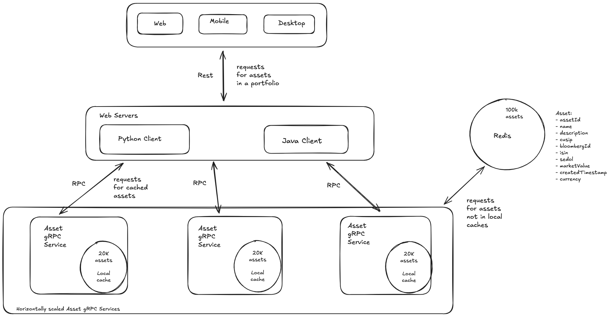

# High Performance Asset Retrieval Service

A high-performance distributed asset management system demonstrating gRPC streaming, multi-level caching, and managed channel round-robin concurrent batch requests.

## Architecture Overview



## Key Features

- **gRPC Streaming**: Client receives streaming responses for large batches
- **Multi-Level Caching**: Caffeine (L1) + Redis (L2)
- **Thread Pool Processing**: Configurable ThreadPoolExecutor in the client with n worker threads, where n = number of gRPC services
- **Asset Data Model**: Complete financial instrument representation (CUSIP, Bloomberg ID, ISIN, SEDOL)
- **Performance Monitoring**: VisualVM integration with JMX metrics
- **Memory Optimized**: Configured for 8GB RAM systems

## Components

### 1. Asset Proto Module

- **Protocol Buffers**: gRPC service definitions
- **Generated Classes**: Java gRPC stubs and data models

### 2. Asset Service Module

- **gRPC Server**: Handles asset requests with streaming responses
- **Caffeine Cache**: In-memory L1 cache for 20k most accessed assets
- **Redis Integration**: L2 cache and persistence for 100k assets
- **Thread Pool**: Async processing with configurable thread pool
- **Inter-service Communication**: gRPC clients to query peer services

### 3. Asset Client Module

- **gRPC Client**: Makes batched requests (20000 assets in 100-asset batches)
- **Performance Testing**: Measures response times and throughput
- **Health Monitoring**: Periodic health checks

## Technical Specifications

### Data Model

```java
Asset {
    String assetId;           // ASSET_000001 to ASSET_100000
    String name;              // Company + Asset Type
    String description;       // Asset description
    String cusip;             // 9-character CUSIP identifier
    String bloombergId;       // Bloomberg terminal identifier
    String isin;              // International Securities ID
    String sedol;             // Stock Exchange Daily Official List ID
    Instant createdTimestamp; // Creation timestamp
    Double marketValue;       // Market value in USD
    String currency;          // Currency code
}
```

### Performance Targets

- **Asset Generation**: Generate 100k unique assets with realistic financial identifiers
- **Cache Distribution**: 20k assets per service (60k total cached across 3 services)
- **Request Processing**: Handle 20k-asset requests in <20 seconds
- **Memory Usage**: <1GB per service on 8GB RAM system
- **Thread Pool**: 10 worker threads with configurable queue size

### System Requirements

- **Java**: JDK 11+
- **Memory**: 8GB RAM
- **Storage**: 128GB+
- **OS**: macOS

## Quick Start

1. **Install Prerequisites**:

   ```bash
   brew install openjdk@11 maven redis
   brew install --cask visualvm
   ```

2. **Setup Redis**:

   ```bash
   brew services start redis
   redis-cli ping  # Should return PONG
   ```

3. **Build Project**:

   ```bash
   mvn clean install
   ```

4. **Start Services** (3 terminals):

   ```bash
   # Terminal 1: Service 1
   java -Xms512m -Xmx1g -jar asset-service/target/asset-service-1.0-SNAPSHOT.jar

   # Terminal 2: Service 2
   java -Xms512m -Xmx1g -Dspring.config.location=classpath:service2-application.properties -jar asset-service/target/asset-service-1.0-SNAPSHOT.jar

   # Terminal 3: Service 3
   java -Xms512m -Xmx1g -Dspring.config.location=classpath:service3-application.properties -jar asset-service/target/asset-service-1.0-SNAPSHOT.jar
   ```

5. **Run Client**:

   ```bash
   java -Xms256m -Xmx512m -jar asset-client/target/asset-client-1.0-SNAPSHOT.jar
   ```

6. **Monitor with VisualVM**:
   ```bash
   jvisualvm
   # Connect to running Java processes
   # Enable CPU and Memory profiling
   ```
